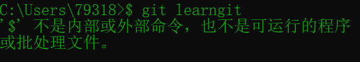

## Github界面
页面分成三大版块，如下图所示，从左至右依次为：自己的仓库(Repositories)、关注的人的动态、发现新的热门/有趣仓库。

## Repository
"repository"有"仓库"的意思，我们可以理解成存放项目所需的各类文件的仓库。不是只包含程序代码，还有学习课程文档等等
## Star
粉丝和关注的人数右边有个星星图标，这就是 Star。,就相当于是收藏+点赞，之后还可以在自己的主页中点击星星图标查看。
## Pull request
点击 Pull request，在弹出的界面填写一些信息，告诉原仓库的作者你做了什么修改、为什么要修改等，方便作者了解你对仓库的改动，然后提交，Pull request 请求就会发送至原仓库的作者。
## Fork
Fork有“叉子”的意思，也就是从原仓库复制建一个我自己的分支（分叉），这样，我做的改动只是在我自己的分支上，不会影响到原仓库，除非我提交的 Pull request 被接受后。
