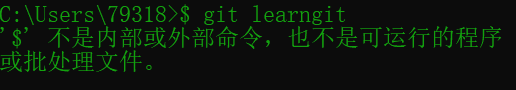
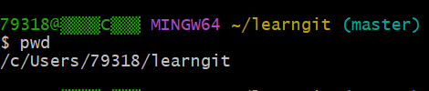
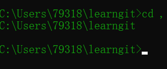
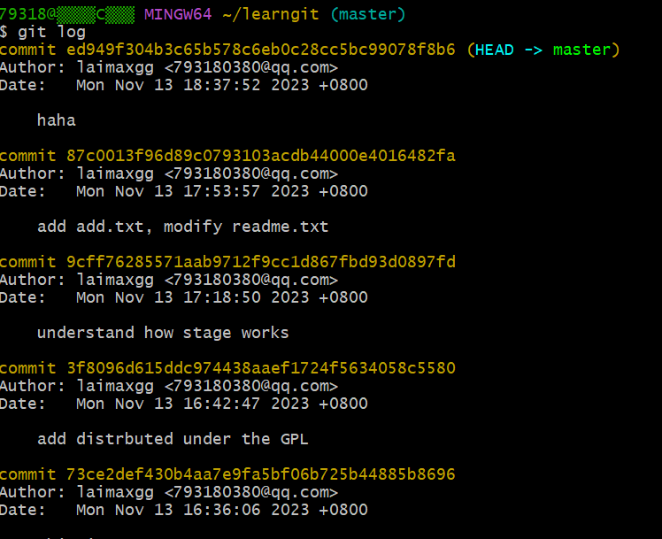

# git的学习与使用
## 1. 前言
通过教程的官网我轻松地在电脑上安装了git，使用git bash或Windows自带的命令提示符（cmd）都可以正常使用，但在使用过程中我发现了git bash和cmd之间的语法有些许不同，其中的原因是git bash支持linux的git操作语法，而cmd则需要遵循Windows的操作语法。
## 2.创建版本库
按照教程提示，通过git bash输入以下代码即可创建并查看`learngit`的文件目录。
>``$ mkdir learngit``
>``$ cd learngit``
>``$ pwd``
>``/Users/michael/learngit``

`$`符号由git bash自带添加，用户不需要输入，而使用cmd则不能输入`$`，否则将会报错：

>

`mkdir learngit`表示创建一个名为learngit的目录。

`cd learngit`表示打开learngit目录，进行这项操作之后输入的部分指令都将在该目录下进行。

`pwd`表示显示当前目录的文件路径，但这个指令在cmd上无法使用，在cmd上可以替换为另一个指令`cd ,`,它们的使用效果是相同的。

git bash上的效果：
>

cmd上的效果：
>

在仓库目录下的文件可以通过`git add`将工作区文件添加到仓库的缓存区。

再通过`git commit -m "注释"`可将缓存区文件保存到仓库里，并在`"注释"`留下本次提交的说明。

## 3.仓库版本回退及仓库管理
当我们对仓库进行多次更新之后，可以通过`git log`指令查看各个版本的修改情况：
>

第一个版本中的`(HEAD -> master)`表示当前的最新版本。

通过` git reset --hard HEAD^`指令可以将仓库回退到上一个版本，其中`^`的数量表示向后回退的版本数，当需要回退的版本过多时可以用`~+数字`回退多个版本，例如回退100个版本：`~100`。

若需要撤销回退版本只需要输入指令` git reset --hard HEAD^`即可回退上一个版本。

也可以通过`git reset --hard +版本号`版本号只需要输入通过`git log`指令中版本编号的前几个数字和字母即可，git会自行查找对应的修改版本。

## 4.仓库文件的修改、删除和撤销
对仓库文件进行修改或删除后，需要使用`git add <filename>`指令将修改后的文件添加到仓库的缓存区，再使用`git commit <filename>`将缓存区文件正式添加到仓库。

如果想撤销对文件的效果，可以通过`git checkout -- <filename>`指令将缓存区的文件清除，若要撤销已经commit的文件，只需要回退到上一个版本就可以。

对于git的删除指令`rm <file name>`，cmd并不支持这个指令，可以使用`del <file name>`代替`rm <file name>`指令，它们的效果是相同的。
## 5.远程仓库
创建远程仓库之前首先要在git上创建一个自己的密钥，使用指令`ssh-keygen -t rsa -C "youremail@example.com"`即可创建自己的ssh密钥。创建成功后，打开目录`.ssh`将目录下的`id_rsa.pu`文件打开，复制内容粘贴到github上的add ssh key里面，点击确认，密钥就算提交成功了。

在GitHub上创建仓库后，在本地仓库下运行命令` git remote add origin git@github.com:<用户名>/<github仓库名>.git`即可将自己的本地库与github上的库远程关联，再使用指令`git push -u origin master`即可将本地仓库当前版本的master推送到github的关联仓库。

## 6.github的fork和pull request
在别人的仓库里点击右上方的fork，可以将别人的仓库在我的github上创建一个分支，然后再通过我的分支对这个仓库进行修改，点击pull request，原仓库的作者会决定是否接受修改，若我的修改被仓库的原主采纳，原仓库才真正被我修改了。